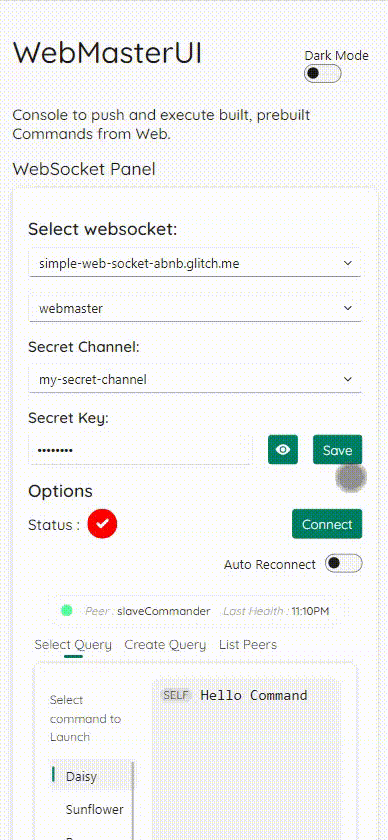

# WebMasterUI
Summary: this is the third link btw the websocket and webcommander, this is WebMasterUI

<!-- 
 -->

<!-- 
    TODO:
        implement list peer method in websocket server -> same in webmaster
        

 -->